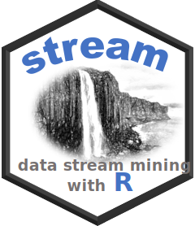

#  R package streamMOA - Interface for MOA Stream Clustering Algorithms

```{r echo=FALSE}
options(digits = 2)
knitr::opts_chunk$set(tidy = TRUE, message = FALSE, fig.path = 'inst/README_files/')
```

```{r echo=FALSE, results = 'asis'}
pkg <- 'streamMOA'

library(stringr)

  cat(str_interp("[](https://CRAN.R-project.org/package=${pkg})\n"))
  cat(str_interp("[](https://mhahsler.r-universe.dev/ui#package:${pkg})\n"))
  cat(str_interp("[](https://CRAN.R-project.org/package=${pkg})\n"))
```

Interface for data stream clustering algorithms implemented in the MOA (Massive Online Analysis) framework. This is an extension package for [stream](https://github.com/mhahsler/stream).

## Installation

* __Stable CRAN version:__ Install from within R.
* __Current development version:__ Install from [r-universe](https://mhahsler.r-universe.dev/ui#package:`r pkg`).

## Example

Create 3 clusters with 5% noise.

```{r}
library(streamMOA)

stream <- DSD_Gaussians(k=3, d=2, noise=.05)
```

Cluster with CluStream.

```{r}
clustream <- DSC_CluStream(m = 50, k = 3)
update(clustream, stream, 500)
clustream
```

Plot micro-clusters.

```{r plot}
plot(clustream, stream)
```

## Further Information

* [streamMOA package vignette](https://CRAN.R-project.org/package=streamMOA/vignettes/streamMOA.pdf) with complete examples.
* [Reference manual](https://CRAN.R-project.org/package=streamMOA/streamMOA.pdf)

