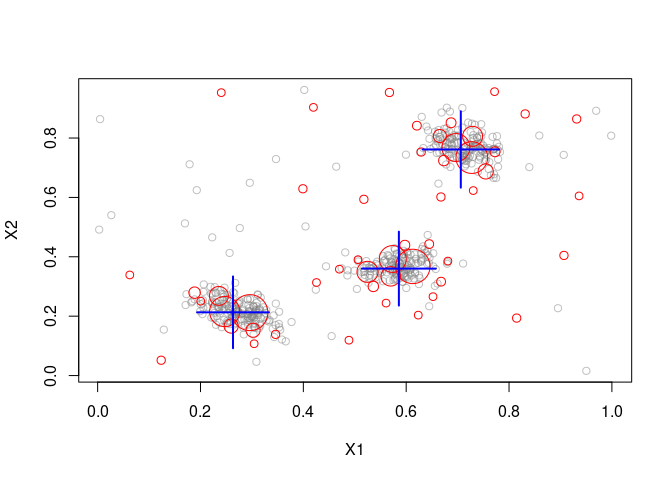

#  R package streamMOA - Interface for MOA Stream Clustering Algorithms

[](https://CRAN.R-project.org/package=streamMOA)
[](https://mhahsler.r-universe.dev/streamMOA)
[](https://CRAN.R-project.org/package=streamMOA)

Interface for data stream clustering algorithms implemented in the MOA
(Massive Online Analysis) framework. This is an extension package for
[stream](https://github.com/mhahsler/stream).

## Installation

**Stable CRAN version:** Install from within R with

``` r
install.packages("streamMOA")
```

**Current development version:** Install from
[r-universe.](https://mhahsler.r-universe.dev/streamMOA)

``` r
install.packages("streamMOA",
    repos = c("https://mhahsler.r-universe.dev". "https://cloud.r-project.org/"))
```

## Example

Create 3 clusters with 5% noise.

``` r
library(streamMOA)

stream <- DSD_Gaussians(k = 3, d = 2, noise = 0.05)
```

Cluster with CluStream.

``` r
clustream <- DSC_CluStream(m = 50, k = 3)
update(clustream, stream, 500)
clustream
```

    ## CluStream 
    ## Class: moa/clusterers/clustream/WithKmeans, DSC_MOA, DSC_Micro, DSC 
    ## Number of micro-clusters: 50 
    ## Number of macro-clusters: 3

Plot micro-clusters.

``` r
plot(clustream, stream)
```

<!-- -->

## Further Information

- [streamMOA package
  vignette](https://CRAN.R-project.org/package=streamMOA/vignettes/streamMOA.pdf)
  with complete examples.
- [Reference
  manual](https://CRAN.R-project.org/package=streamMOA/streamMOA.pdf)
