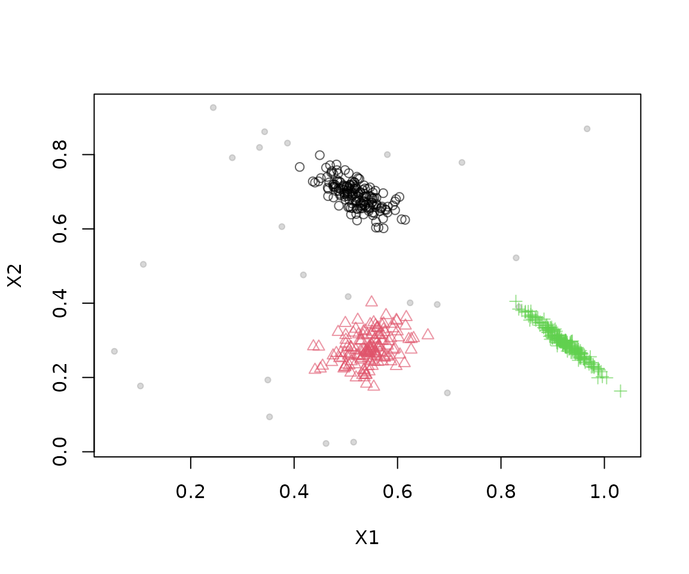
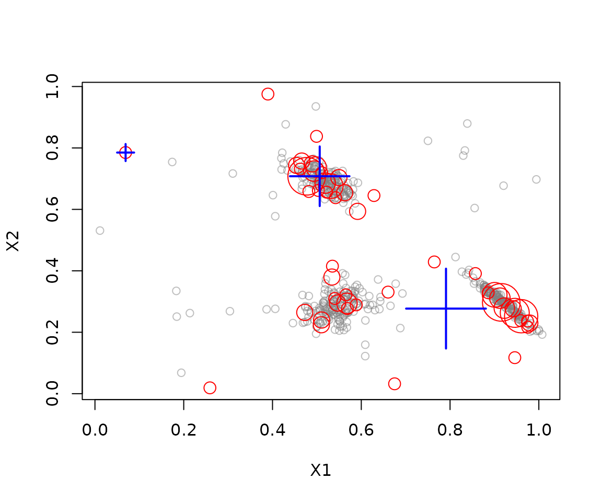

# Getting started with streamMOA

The `streamMOA` package connects
[stream](https://CRAN.R-project.org/package=stream) to clustering
algorithms from MOA (Massive Online Analysis). This vignette shows how
to create a data stream, process it with a MOA clusterer, and inspect
the resulting micro- and macro-clusters. Java 8 or later is required.

## Installation

Install the package from CRAN and load it together with `stream`:

``` r

install.packages(c("stream", "streamMOA"))
```

``` r

library(streamMOA)
library(stream)
```

## Create a data stream

[`DSD_Gaussians()`](https://rdrr.io/pkg/stream/man/DSD_Gaussians.html)
from `stream` generates a stream with three clusters and a small amount
of noise. Request a finite number of observations with
[`get_points()`](https://rdrr.io/pkg/stream/man/get_points.html):

``` r

stream <- DSD_Gaussians(k = 3, d = 2, noise = 0.05)
get_points(stream, n = 5)
#>          X1        X2 .class
#> 1 0.5458535 0.6891478      1
#> 2 0.5751342 0.3031995      2
#> 3 0.5070179 0.2583102      2
#> 4 0.5436979 0.3234242      2
#> 5 0.6294917 0.2378384      2
```

Stream observations are generated as requested, so plotting or
retrieving points advances the stream. Set `info = FALSE` when only
feature values are needed and cluster labels are not required.

``` r

plot(stream, n = 500)
```



## Cluster the stream

[`DSC_CluStream()`](http://michael.hahsler.net/streamMOA/reference/DSC_CluStream.md)
creates a MOA-based online clusterer. The `m` parameter sets the maximum
number of micro-clusters, while `horizon` controls the time window. The
optional `k` argument enables weighted k-means reclustering to produce
macro-clusters. Use [`update()`](https://rdrr.io/r/stats/update.html) to
train the clusterer on incoming observations:

``` r

clustering <- DSC_CluStream(m = 50, horizon = 100, k = 3)
update(clustering, stream, n = 500)
clustering
#> CluStream 
#> Class: moa/clusterers/clustream/WithKmeans, DSC_MOA, DSC_Micro, DSC 
#> Number of micro-clusters: 50 
#> Number of macro-clusters: 3
```

## Inspect the result

The micro-clusters summarize recent observations. Macro-clusters group
those summaries into a smaller number of clusters. Retrieve their
centers or plot them with the stream:

``` r

get_microclusters(clustering)
#>            X1         X2
#> 1  0.96016355 0.25227255
#> 2  0.52182990 0.65601731
#> 3  0.56865733 0.27717631
#> 4  0.59170698 0.59359064
#> 5  0.47697525 0.70780938
#> 6  0.56252095 0.65414713
#> 7  0.62859918 0.64503513
#> 8  0.94575395 0.26314770
#> 9  0.90051402 0.32183734
#> 10 0.47266308 0.26457753
#> 11 0.06906004 0.78503328
#> 12 0.49812901 0.73775921
#> 13 0.88587126 0.32857369
#> 14 0.67503717 0.03219842
#> 15 0.66036942 0.33072764
#> 16 0.95921384 0.23785634
#> 17 0.51005490 0.22444148
#> 18 0.85708086 0.39108658
#> 19 0.46590908 0.75736211
#> 20 0.49915306 0.83779142
#> 21 0.91234022 0.31101102
#> 22 0.54019816 0.31004215
#> 23 0.56780590 0.29400499
#> 24 0.94228753 0.27649655
#> 25 0.58861360 0.28917296
#> 26 0.97970058 0.22987894
#> 27 0.54200968 0.63802303
#> 28 0.46254419 0.73116493
#> 29 0.45423587 0.74317222
#> 30 0.51865811 0.68553151
#> 31 0.53498163 0.41515597
#> 32 0.48949698 0.74816497
#> 33 0.56540750 0.32188795
#> 34 0.54953709 0.70341318
#> 35 0.94582852 0.11728255
#> 36 0.48188183 0.65824329
#> 37 0.51111227 0.71930316
#> 38 0.53377445 0.37971801
#> 39 0.38967593 0.97536916
#> 40 0.97494889 0.21642202
#> 41 0.54640408 0.29501257
#> 42 0.92216660 0.27849330
#> 43 0.51054455 0.23977742
#> 44 0.53112220 0.67558870
#> 45 0.76448880 0.42889785
#> 46 0.49323525 0.72460230
#> 47 0.50321580 0.66157570
#> 48 0.25899523 0.01903151
#> 49 0.91534332 0.29725388
#> 50 0.97447349 0.23670116
get_macroclusters(clustering)
#>           X1        X2
#> 1 0.06906004 0.7850333
#> 2 0.79085288 0.2770008
#> 3 0.50634679 0.7078762
plot(clustering, stream, type = "both")
```



Other clusterers include
[`DSC_DenStream()`](http://michael.hahsler.net/streamMOA/reference/DSC_DenStream.md),
[`DSC_ClusTree()`](http://michael.hahsler.net/streamMOA/reference/DSC_ClusTree.md),
[`DSC_DStream_MOA()`](http://michael.hahsler.net/streamMOA/reference/DSC_DStream_MOA.md),
[`DSC_BICO_MOA()`](http://michael.hahsler.net/streamMOA/reference/DSC_BICO_MOA.md),
and
[`DSC_StreamKM()`](http://michael.hahsler.net/streamMOA/reference/DSC_StreamKM.md).
See their help pages and the package vignette *Introduction to
streamMOA* for algorithm details, options, and additional examples.
